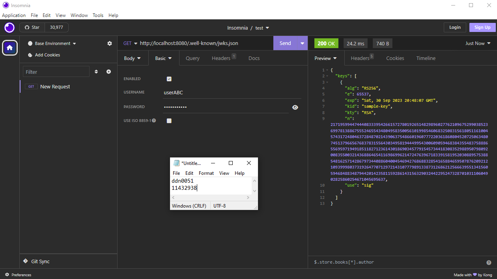

# Basic JWKS server implementation

This is a basic implementation of a JWKS server using Python with Flask and Cryptography

## Table of Contents

- [Installation](#installation)
- [Usage](#usage)
- [Test](#test)
- [Result](#result)

## Installation

This project use Python 3.11.5
To run the server, make sure you have Flask and Cryptography installed on your machine

To install Flask:
pip install Flask

To install Cryptography:
pip install cryptography

To conduct tests using the provided test file, you need to have Coverage:
pip install coverage

## Usage

To run the server simply do: python -m server

## Test

I have written in total 6 test cases for the server. You can see them in test.py
I am using Unittest for testing and Coverage for the report

Running coverage with it not in $PATH:
python -m coverage run test
python -m coverage report (to see the result)

Running with coverage in $PATH:
coverage run test
coverage report (to see the result)

## Result

Here you can see screenshots of my tests with my own tests, POST and GET tests using Insomnia, and a blackbox test that you can access
Here: https://github.com/jh125486/CSCE3550/releases

My own test file:

POST test using insomnia:

GET test using insomnia:

Blackbox testing:

