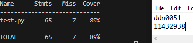

# Basic JWKS server implementation

This is a basic implementation of a JWKS server using Python with Flask and Cryptography

## Table of Contents

- [Installation](#installation)
- [Usage](#usage)
- [Test](#test)
- [Result](#result)

## Installation

This project use Python 3.11.5
To run the server, make sure you have Flask and Cryptography installed on your machine

To install Flask: 
**pip install Flask**

To install Cryptography: 
**pip install cryptography**

To conduct tests using the provided test file, you need to have Coverage: 
**pip install coverage**

## Usage

To run the server simply do: 
**python -m server**

## Test

I have written in total 7 test cases for the server. You can see them in test.py
I am using Unittest for testing and Coverage for the report

Running coverage with it not in $PATH: 
**python -m coverage run test** 
**python -m coverage report** (to see the report) 

Running with coverage in $PATH: 
**coverage run test** 
**coverage report** (to see the report) 

## Result

Here you can see screenshots of my tests with my own tests, POST and GET tests using Insomnia, and a blackbox test that you can access 
Here: https://github.com/jh125486/CSCE3550/releases

**My own test file:** 

**POST test using insomnia:** 

**GET test using insomnia:** 

**Blackbox testing:** 

